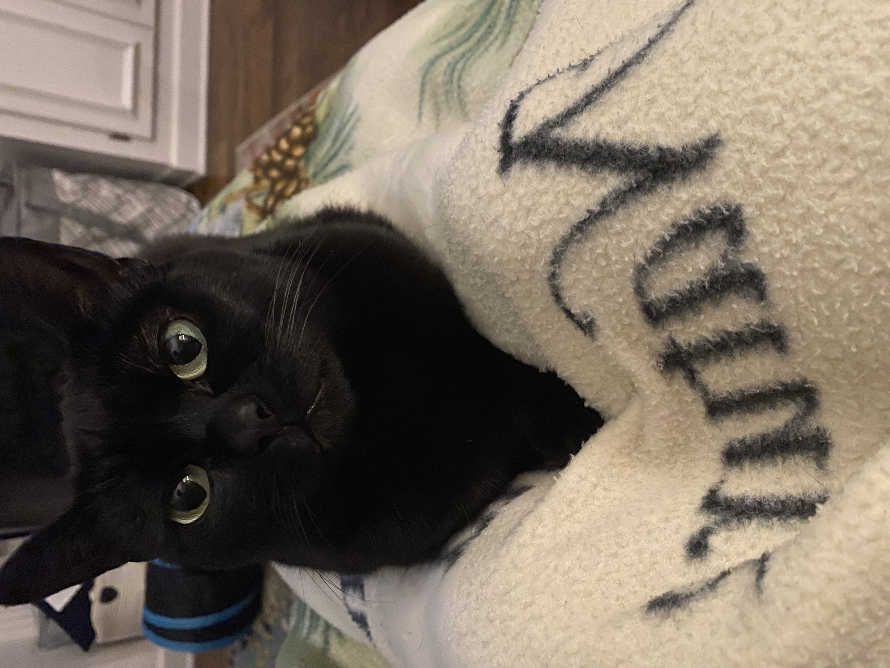

# Welcome to my presentation:)

Jenn Derkits- The oldest grad student (LOL)


# Introduction

Hello, I'm Jenn Derkits  
Here’s a little information about me:

- **Birthday**: December 2
- **I grew up in**: Richmond, VA
- **Ph.D Program**: Agronomy & Horticulture - Genomics
- **Expected Graduation**: 2027


# My Favorite Animal is a cat!

  <!-- Replace with actual image path -->

# My Favorite Plot to make from class so far: The Ugly Plot

```{r pressure_plot, echo=FALSE}
if (!"palmerpenguins" %in% installed.packages()) {
  remotes::install_github("allisonhorst/palmerpenguins")
}
library(palmerpenguins)
library(ggplot2)

# Omit missing values
penguins <- na.omit(penguins)

# Create the plot
plot <- ggplot(penguins, aes(x = body_mass_g, y = bill_length_mm, color = species)) +
  geom_point(size = 8, shape = 17) +  # Large point size with a triangle shape
  scale_color_manual(values = c("darkgreen", "hotpink", "yellow")) +  # Custom color choices
  theme_minimal(base_size = 20, base_family = "sans") +  # Use minimal theme
  theme(
    plot.background = element_rect(fill = "green"),  # Green background
    panel.grid.major = element_line(color = "orange", linewidth = 2),  # Thick orange grid lines
    panel.grid.minor = element_line(color = "purple", linewidth = 1),  # Thinner purple grid lines
    axis.text = element_text(size = 14, color = "darkred"),  # Red axis text
    axis.title.x = element_text(size = 20, angle = 25, vjust = 0.5),  # Slightly tilted x-axis label
    axis.title.y = element_text(size = 17, angle = 90),  # Y-axis label remains vertical
    legend.background = element_rect(fill = "black", color = "red", linewidth = 3),  # Black background with red border
    legend.text = element_text(size = 15, color = "blue"),  # Blue text in the legend
    legend.title = element_text(size = 20, face = "bold", color = "yellow"),  # Yellow bold legend title
    legend.position = "bottom",  # Legend at the bottom
    legend.key = element_rect(fill = "pink", color = "green", linewidth = 3)  # Pink and green legend keys
  ) +
  labs(title = "Penguin Plot", x = "Body Mass (g)", y = "Bill Length (mm)", color = "Species")  # Labels

# Suppress warnings related to missing values
suppressWarnings(print(plot))
```

# My CV


[Click here to view my CV](CV.pdf)


